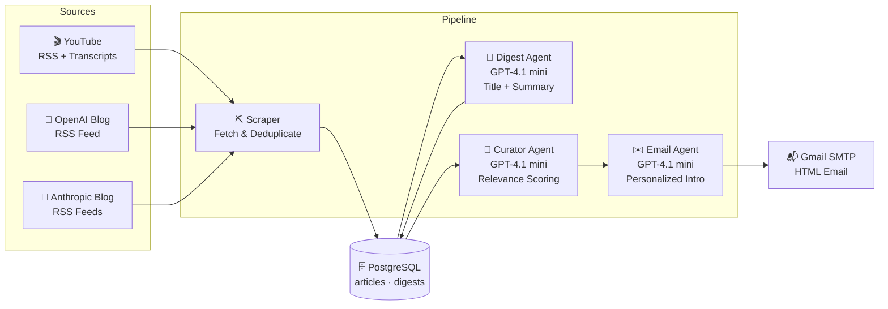

# AI News Aggregator

An automated pipeline that scrapes AI news from multiple sources, generates LLM-powered summaries, ranks articles by personal relevance, and delivers a curated daily email digest.

## Architecture



**Step 1 — Scrape**: Fetches recent content from YouTube (RSS + transcripts), OpenAI blog (RSS), and Anthropic blog (RSS). Deduplicates by URL.

**Step 2 — Digest**: For each new article, GPT-4.1 mini generates a title and 2-3 sentence summary via structured output (Pydantic models).

**Step 3 — Curate**: All unsent digests are batch-scored (1-10) against your user profile. One API call scores all items.

**Step 4 — Email**: The top 10 articles get a personalized intro paragraph, then everything is rendered into an HTML email and sent via Gmail SMTP.

## Project Structure

```
app/
├── config.py              # Environment, YouTube channels, lookback settings
├── user_profile.py        # Your interests (used by the Curator agent)
├── runner.py              # Pipeline orchestrator + scheduler
├── scrapers/
│   ├── base.py            # Base RSS scraper (shared HTTP, parsing, content fetch)
│   ├── youtube.py         # YouTube RSS + transcript scraper
│   ├── openai_blog.py     # OpenAI blog scraper (extends base)
│   └── anthropic_blog.py  # Anthropic blog scraper (extends base)
├── database/
│   ├── models.py          # SQLAlchemy models (articles, digests)
│   ├── connection.py      # DB engine + session factory
│   ├── repository.py      # CRUD with URL deduplication
│   └── create_tables.py   # Schema initialization
└── agent/
    ├── summarizer.py      # Digest agent (article → title + summary)
    ├── digest_service.py  # Processes articles without digests
    ├── curator.py         # Curator agent (batch relevance scoring)
    ├── curation_service.py# Pulls unsent digests + runs curator
    ├── email_agent.py     # Generates personalized email intro
    └── email_sender.py    # HTML template + Gmail SMTP delivery
```

## Setup

### Prerequisites

- Python 3.12+
- [uv](https://docs.astral.sh/uv/) package manager
- Docker (for local PostgreSQL)

### 1. Clone and install

```bash
git clone <your-repo-url>
cd ai-news-aggregator-local
uv sync
```

### 2. Start the database

```bash
docker compose -f docker/docker-compose.yml up -d
```

### 3. Configure environment

Copy `.env.example` to `.env` and fill in your values:

```bash
cp .env.example .env
```

| Variable            | Description                                                                       |
| ------------------- | --------------------------------------------------------------------------------- |
| `ENVIRONMENT`       | `local` or `production`                                                           |
| `DATABASE_URL`      | PostgreSQL connection string                                                      |
| `OPENAI_API_KEY`    | OpenAI API key for GPT-4.1 mini                                                   |
| `SMTP_EMAIL`        | Gmail address for sending                                                         |
| `SMTP_APP_PASSWORD` | Gmail App Password ([create one here](https://myaccount.google.com/apppasswords)) |
| `RECIPIENT_EMAIL`   | Email address to receive the digest                                               |

### 4. Create tables

```bash
uv run python -m app.database.create_tables
```

### 5. Run the pipeline

```bash
# One-shot run
uv run python -m app.runner

# Scheduled (every 24 hours)
uv run python -m app.runner --schedule
```

## Adding a New Scraper

The codebase is designed for easy extension. To add a new RSS source:

```python
# app/scrapers/my_source.py
from app.scrapers.base import RSSScraperBase

class MySourceScraper(RSSScraperBase):
    @property
    def feed_urls(self) -> list[str]:
        return ["https://example.com/rss.xml"]

    @property
    def source_name(self) -> str:
        return "MySource"

    def _parse_item(self, item, **kwargs):
        # Parse XML <item> → your Pydantic model
        ...
```

Then add a `SourceType` enum value in `models.py`, a save wrapper in `repository.py`, and wire it into `runner.py`.

## Deployment (Render)

The project includes a `render.yaml` blueprint for one-click deployment:

- **Cron Job**: Runs the pipeline daily at 8am UTC
- **Managed PostgreSQL**: Auto-provisioned, connection string injected

```bash
# Push to GitHub, then connect via Render Dashboard → New → Blueprint
git push origin deployment
```

Set secret env vars (`OPENAI_API_KEY`, `SMTP_EMAIL`, `SMTP_APP_PASSWORD`, `RECIPIENT_EMAIL`) in the Render dashboard.

## Tech Stack

| Component       | Technology                           |
| --------------- | ------------------------------------ |
| Language        | Python 3.12                          |
| Package Manager | uv                                   |
| Database        | PostgreSQL 16                        |
| ORM             | SQLAlchemy                           |
| HTTP Client     | httpx                                |
| LLM             | OpenAI GPT-4.1 mini (Responses API)  |
| Email           | Gmail SMTP (smtplib)                 |
| Deployment      | Render (Cron Job + Managed Postgres) |
